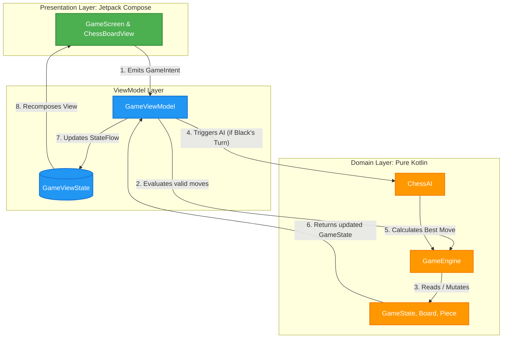

# Chess Application Architecture

This application is built using modern Android development principles, primarily focusing on **Clean Architecture** and the **Model-View-Intent (MVI)** design pattern. This approach ensures separation of concerns, high testability, and a predictable unidirectional data flow.

## 1. Architectural Patterns

### Clean Architecture
The codebase is structured to separate the core business rules from UI and framework details. 
- **Domain Layer**: The heart of the application. It contains all chess logic and rules, completely independent of the Android framework.
- **Presentation Layer**: Handles user interactions and rendering the UI, relying entirely on the Domain layer for logic.

### Model-View-Intent (MVI)
To manage the state of the chessboard and the game reliably, the UI follows the MVI pattern (Unidirectional Data Flow):

- **Intent**: User actions (e.g., clicking a square to select a piece, or clicking to make a move) are modeled as `GameIntent` objects.
- **Model (ViewModel)**: The `GameViewModel` receives these intents, processes them using the Domain layer's `GameEngine`, and updates a single source of truth: the `GameViewState`.
- **View**: The Jetpack Compose UI observes the `GameViewState`. Whenever the state changes (e.g., piece moved, checkmate achieved), the UI recomposes automatically to reflect the new state.

---

## 2. Layer Breakdown

### Domain Layer (`com.venug.chessapp.domain`)
This layer represents the pure Kotlin business logic. It consists of:

- **Models (`models/`)**: 
  - immutable data structures representing the chess primitives: `Board`, `Piece`, `Position`, `Move`, `Player`, `PieceType`, and the overarching `GameState`.
  - The `Board` is designed to be easily copyable, ensuring the state remains immutable during move validation and state updates.

- **Game Engine (`engine/GameEngine.kt`)**: 
  - Contains the core rules of chess.
  - Generates pseudo-legal moves for every piece type.
  - Filters those moves to ensure they are valid (e.g., a move cannot leave the King in check).
  - Determines game-ending conditions like Check, Checkmate, and Stalemate.

- **AI Engine (`engine/ChessAI.kt`)**: 
  - Implements a single-player opponent using the **Minimax Algorithm** with **Alpha-Beta Pruning**.
  - Evaluates board states based on material advantage heuristics.

### Presentation Layer (`com.venug.chessapp.presentation`)
This layer handles the Android UI and bridging the gap to the Domain logic.

- **`GameViewModel`**: 
  - The orchestrator. It holds the `MutableStateFlow<GameViewState>`.
  - Handles `GameIntent.SelectSquare` to determine if the user is selecting a piece or making a move, and calculates the valid moves to highlight for the UI.
  - Calls the `ChessAI` automatically on Black's turn.

- **Jetpack Compose UI (`ui/`)**:
  - `GameScreen`: The main container that observes the ViewModel's state and displays turn indicators and game-over statuses.
  - `ChessBoardView`: Responsible for drawing the 8x8 grid. It reacts to `selectedPosition` and `validMoves` in the state to highlight squares and display piece unicode characters.

---

## 3. Dependency Injection
**Dagger Hilt** is used to provide dependencies across the application.
- `ChessApplication` acts as the `@HiltAndroidApp` entry point.
- `GameEngine` and `ChessAI` are provided via `@Inject` constructors directly into the `GameViewModel`.
- `GameScreen` accesses the injected ViewModel using the `hiltViewModel()` compose delegate.

## 4. Why this Architecture?

1. **Testability**: The `GameEngine` can be thoroughly unit-tested using standard JUnit without requiring Robolectric or Android emulators, as it has zero Android dependencies.
2. **Predictability**: Modifying the `GameState` can only happen by dispatching a `GameIntent` to the ViewModel. This eliminates hard-to-track bugs where multiple views try to modify the local state concurrently.
3. **Scalability**: New features, like PGN History or Network Play, can be added as new Interactors/UseCases in the Domain Layer without significantly refactoring the UI or Engine layers.
